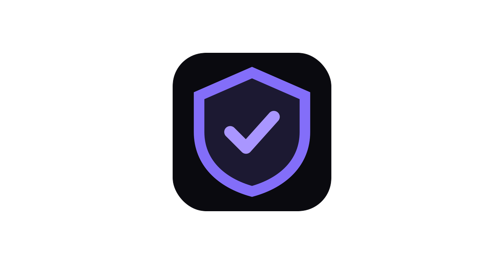

<div align="center">



# Reckon

### On Monad, failure isn't free. Reckon makes sure you stop paying for it.

[](https://reckon-monad-seatbelt.vercel.app)
[](https://testnet.monadscan.com/address/0x84e5C3c524f473c19821ae2D1494b274730bB6AE)
[](https://www.npmjs.com/package/@codeswithroh/reckon-core)
[](https://www.npmjs.com/package/@codeswithroh/reckon-sdk)
[](#license)

**[Live app](https://reckon-monad-seatbelt.vercel.app)** · **[The problem](#the-problem-i-had)** · **[How it works](#how-it-works)** · **[Proof it is real](#proof-it-is-real)** · **[For developers](#for-developers)**

</div>

---

While building on Monad testnet this week, I kept losing MON on transactions that **failed**. On Monad you are charged the full gas limit you declare, even when the transaction reverts. Most people do not learn this until it has already cost them.

So I built the thing that stops it. Reckon checks every transaction before you sign, refuses the doomed ones before your wallet even opens, and shows you exactly how much you were about to lose.

> **The one moment that matters:** click a transaction that would fail, and your wallet never opens. `BLOCKED, never reached your wallet.` No revert, no wasted gas, no signature.

<div align="center">

### [▶ Try it on your own wallet](https://reckon-monad-seatbelt.vercel.app/app)

*Connect a real wallet, or paste any Monad address to see what it has already burned.*

</div>

---

## Contents

- [The problem I had](#the-problem-i-had)
- [How it works](#how-it-works)
- [Proof it is real](#proof-it-is-real)
- [Try it yourself](#try-it-yourself)
- [For developers](#for-developers)
- [Built with](#built-with)
- [License](#license)

## The problem I had

On most chains you pay for the gas your transaction actually used. On Monad you pay for the gas limit you **declared**, whether you used it or not, and **even when the transaction reverts**.

That means a single failed action, a sold-out mint, an underpriced swap, a call to a function that no longer exists, costs you real MON for nothing. Your wallet often pads the limit even higher on a revert-probe, so the bill is worse than you would guess.

I did not assume this. I proved it against live testnet, reproducible in [`research/gas-model/`](./research/gas-model/VERIFICATION.md):

- A **reverted** transaction paid its **full declared gas limit**, balance delta exact to the wei ([tx](https://testnet.monadexplorer.com/tx/0x272f56f75f38199c6cc1a465df6bb0c310bae51beaa4ea6500e15107f7fb29b8)).
- In **40 of 40** sampled transactions, `receipt.gasUsed == gasLimit`. The chain hides your real usage.
- One Monad airdrop recipient burned roughly **$112,700** on failed transactions. The testnet failure rate sits around **6%**.

There was no Monad-native tool that stops this before it happens. Reckon is that tool.

## How it works

One simple loop: **see what you have burned, catch the next one, keep your MON.**

**1. See it.** Connect your wallet, or paste any address. Reckon scans your real recent Monad history and tells you, in plain English, how much MON you burned on failed transactions and which risky approvals are still open.

**2. Catch it.** Every transaction runs through a real pre-flight first. Reckon simulates it against live Monad, and:

- if it would **revert**, Reckon refuses to send it, and your wallet never even opens;
- if it would **succeed but is dangerous** (an unlimited token approval, an NFT operator grant), it reaches your wallet clearly flagged so you decide on purpose, not by reflex;
- if it is **healthy**, it goes through with the tightest correct gas limit, so you stop overpaying.

**3. Keep it.** Found an old unlimited approval you forgot about? One click sends a real revoke and it is gone.

```ts
const v = await reckon.preflight(tx)
// {
//   willRevert: true,
//   revertReason: "SoldOut()",
//   recommendedGasLimit: 61_000n,   // Monad-correct, not an Ethereum guess
//   worstCaseFeeMON: "0.0062",      // what you would actually be charged
//   savingsVsNaiveMON: "0.045"      // MON the wallet default would have burned
// }
await reckon.safeSend(tx)           // refuses to broadcast a doomed tx
```

## Proof it is real

This hackathon explicitly penalizes fake demos and hardcoded results. Nothing here is mocked. Every number is a real balance delta and every hash below is a real Monad testnet transaction you can open right now.

| What happened | Real transaction |
|---|---|
| Healthy send, gas tightened, went through | [`0xb613…9ae7`](https://testnet.monadexplorer.com/tx/0xb613575a6f9dc5107e4ff9a0bc76bcb64dea3ec220da775aa708c2f470b79ae7) |
| Unlimited approval, sent but flagged critical | [`0xb2e9…2eca`](https://testnet.monadexplorer.com/tx/0xb2e92e5e8969f42ceb8e1b9d4d9cbcca6faf101b2afc4ea2b36c6ddcbc842eca) |
| That approval, revoked in one click | [`0xd465…8323`](https://testnet.monadexplorer.com/tx/0xd465c6b769c300ab137e0bf4a9861905c26f4e611da92cb935e0338ab94f8323) |

And the doomed transaction? It has **no hash**, because Reckon refused to send it. That is the whole point.

Backed by a real test suite, all run against live testnet plus a local EVM:

- `packages/core` pre-flight engine, gas model, and risk detection, **49/49**
- `packages/sdk` wallet guard and viem wrapper, **8/8**
- `packages/agent` MCP guard, **9/9**
- `contracts/` GuardedExecutor, **16/16**, source-verified at [`0x84e5…B6AE`](https://testnet.monadscan.com/address/0x84e5C3c524f473c19821ae2D1494b274730bB6AE)

A naive agent run on live testnet burned **0.0408 MON** on a revert plus an oversized limit. The same agent behind Reckon spent **0.0024 MON**, a **~94% reduction**, every transaction verifiable on the explorer.

## Try it yourself

The live app runs entirely in your browser against Monad testnet, no backend:

**→ [reckon-monad-seatbelt.vercel.app/app](https://reckon-monad-seatbelt.vercel.app/app)**

Or run the engine locally and watch it pre-flight a healthy transaction and refuse a doomed one against real testnet:

```bash
npm install
cd packages/core && npm run build && node examples/demo.mjs
```

Want to confirm the underlying problem for yourself first?

```bash
cd research/gas-model && npm install && npm run summary
```

## For developers

Reckon is a product you can use in one click, but the same pre-flight engine is packaged so you can drop it into your own code. This part is not required to use the app; it is here if you build on Monad too.

```ts
import { createGuardedProvider } from "@codeswithroh/reckon-sdk"

// wrap any wallet: doomed sends are blocked before the wallet ever prompts
const provider = createGuardedProvider(walletProvider)
```

| Surface | For | What it does |
|---|---|---|
| **SDK** ([`reckon-sdk`](https://www.npmjs.com/package/@codeswithroh/reckon-sdk)) | dApps and deploy scripts | drop-in viem wrapper: `preflight()`, `safeSend()`, `createGuardedProvider()` |
| **Agent guard** (`packages/agent`) | autonomous AI agents | an MCP server so agents pre-flight every transaction before sending |
| **GuardedExecutor** (`contracts/`) | on-chain | bounded, policy-enforced batch execution |

```
packages/core    pre-flight engine (simulate + Monad gas model + risk detection)
packages/sdk     drop-in viem middleware + wallet guard
packages/agent   MCP server / agent guard
contracts/       Foundry: GuardedExecutor + MockToken
web/             Next.js app (the product) + landing page
research/        live-testnet gas-model verification (reproducible)
```

**Honest accounting:** all savings come from acting **before** you broadcast, by not sending failures and by declaring the tightest correct limit. Once a transaction is on-chain, Monad charges the limit. Nothing here pretends to refund gas.

## Built with

Monad testnet · viem · wagmi (EIP-6963) · Foundry · Solidity + OpenZeppelin · MCP · Next.js. Built for the [Spark](https://buildanything.so/hackathons/spark) hackathon.

## License

MIT
